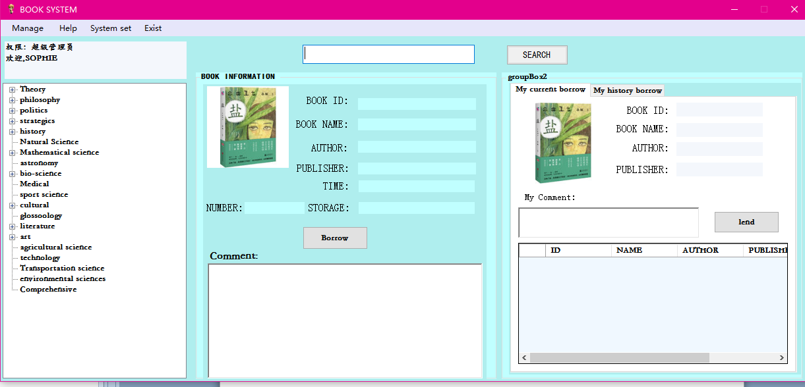

## 项目封面

## 项目介绍

- 项目名称：Book Management System(图书管理系统)
- 项目描述：该软件为Windows窗体应用程序，有用到ADO.NET连接SQL Server，主要用到的高级控件有Treeview(淑控件)用于做书籍分类导航，DataGridView控件绑定数据源显示数据。主要的业务逻辑为：用户登录程序，所有用户可以通过树形导航栏点取书籍或者搜索书籍名称，找到则右侧会显示相应信息，用户可以选择借书，借书后最右侧会显示借阅信息，此时用户可以点击还书。超级管理员可以对书籍数据进行录入或者删除

- 开发周期：2个星期(2017.12.14~2017.12.28)
- 开发人员：个人独立完成
- 开发工具：visual studio2013 + SQL Server 2008

### Notes

Thank you look this :
If you want to use the aplication ,you need connect your MSSQLSERVER ,And the data is in the fold DATA(including: BOOK_MANAGE_SYSTEM.mdf and BOOK_MANAGE_SYSTEM_log.ldf ) ,you can copy it to your MSSQLSERVER .
If you want to manage book ,you can use Sophie's account :
ID :SOPHIE 
PASSWORD:12345